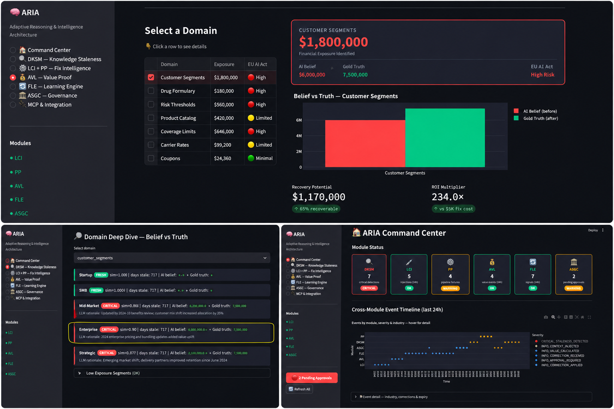
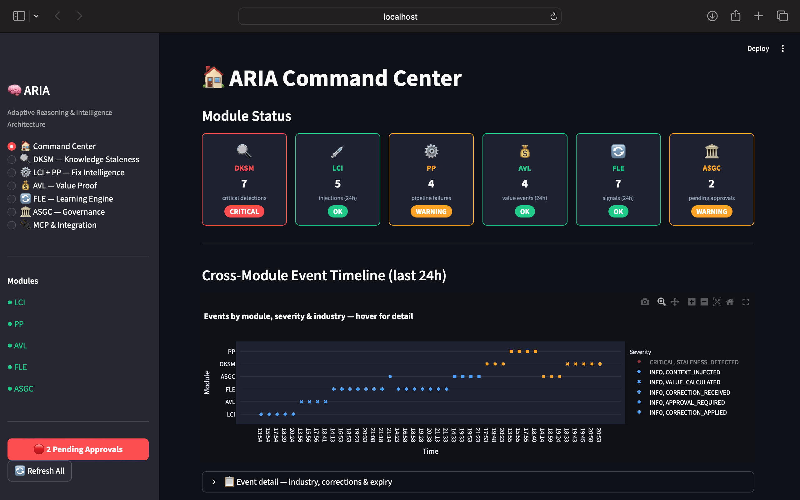
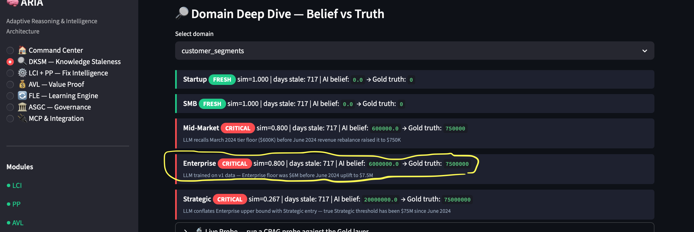
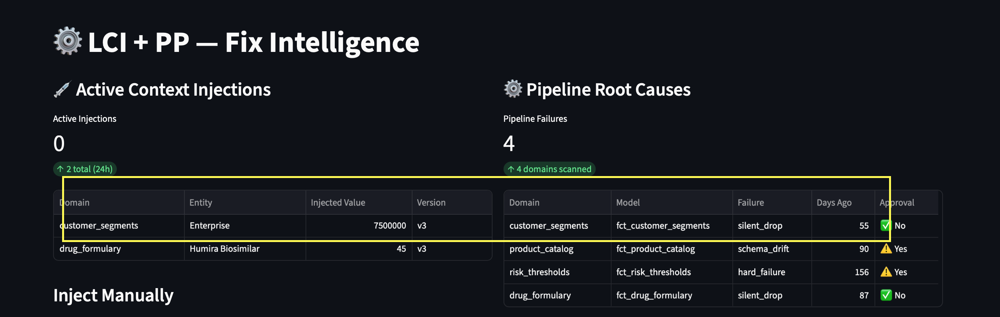
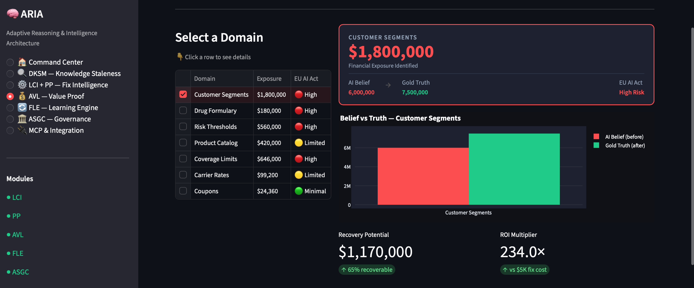
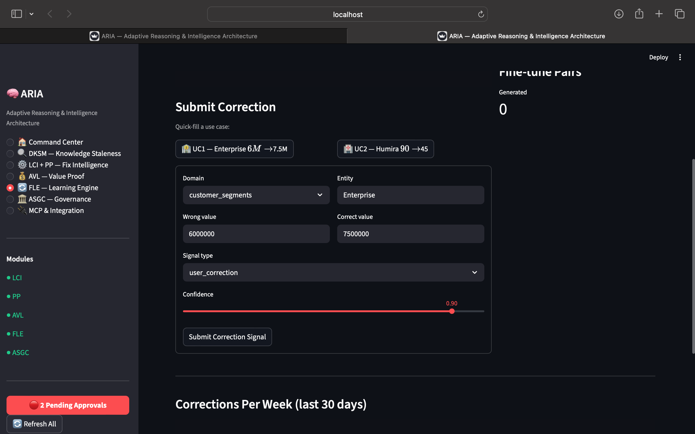
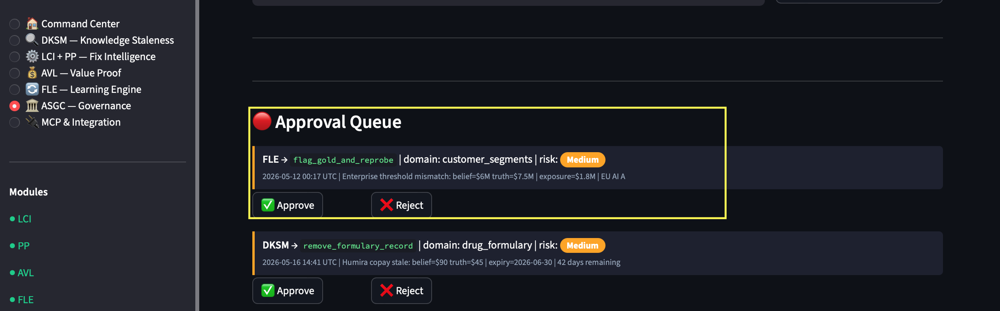

# ARIA — Real-Time AI Knowledge Integrity

> Your AI chatbot answers from a pre-indexed knowledge base.
> That index goes stale. Nobody notices. Customers get wrong answers.
>
> ARIA detects the drift and injects the correct data before the response —
> no retraining, no pipeline changes, zero added latency.


---

## The Problem

Most production AI systems (chatbots, support agents, knowledge tools) answer from a pre-indexed embedding store — not from live queries. That index is optimized for speed, not freshness. When your drug formulary changes, your carrier rates expire, or your pricing updates — the index doesn't know. The AI answers with complete confidence. And it's wrong.

By the time a wrong answer surfaces (a mispriced quote, a denied claim, a failed compliance audit), the damage is done. And you still don't know *why* it happened, *how long* it's been wrong, or *which pipeline run* caused it.

**ARIA closes that loop end-to-end:**

```
Detect drift → Inject correct context → Trace root cause → Quantify impact → Learn
```

---

## Why doesn't the LLM just query live data on every call?

Most production chatbots pre-index their knowledge base into embeddings for speed and cost. A live Snowflake query on every user message adds 200–800ms and real money at scale. The index trades freshness for performance.

**ARIA bridges the gap without the latency penalty:**

```
                      User prompt arrives
                              │
        ┌─────────────────────┴──────────────────────┐
        ▼                                            ▼
  LLM generates response              ARIA staleness check
  (200–800ms, from index)           (cached metadata, ~20ms)
        │                                            │
        └─────────────────────┬──────────────────────┘
                              ▼
              ARIA already knows: inject correction? yes/no
                              │
                              ▼
              Final response → user (zero added latency)
```

ARIA's check runs in parallel with model generation using cached metadata — not a full warehouse query. Only on STALE/CRITICAL detection does it fetch the verified value and inject it into the prompt. ARIA's check completes in ~20ms while model generation takes 200–800ms, so no net latency is added when model generation dominates.

---

## Project Goal

ARIA is a **real-time AI knowledge integrity layer** that sits between your AI systems and your data warehouse. It continuously monitors whether the retrieval index your AI answers from still matches ground truth in your Gold layer, and takes corrective action automatically — without re-indexing the entire knowledge base, without touching model weights, and without changing any existing pipeline.

The system is designed for regulated industries where AI getting facts wrong has direct financial or compliance consequences: **insurance, healthcare, financial services, and logistics**.

---

## Who Is This For

- Data engineers maintaining ML pipelines in regulated industries where data drift has direct compliance risk
- AI/ML engineers whose models answer from pre-indexed knowledge bases (drug formularies, rate tables, coverage rules)
- Compliance teams in insurance, healthcare, or financial services needing AI audit trails for regulators
- Platform teams building production AI systems that must not answer from stale data, period

---

## Quickstart

```bash
git clone https://github.com/Itachi-0xAI/aria.git
cd aria
pip install -r requirements.txt
cp .env.example .env          # add ANTHROPIC_API_KEY, or leave blank for demo mode
streamlit run aria.py         # → http://localhost:8501
```

**Demo mode is on by default** — the full 7-page dashboard runs without an API key using simulated data across all 7 domains. To enable live Anthropic API calls (CRAG probes + `inject_and_prompt()`), set `demo_mode: false` in `config/aria_config.yaml` and add your API key to `.env`.

## Production Setup (free APIs, zero cost)

```bash
# 1. Get a free Groq key at https://console.groq.com/keys (no credit card)
echo "GROQ_API_KEY=gsk_your_key_here" >> .env

# 2. Publish your Gold layer Google Sheet (Share → Anyone with link → Viewer)
#    Then set its ID and flip the source in config/aria_config.yaml:
#      gold_layer.source: sheets
#      gold_layer.spreadsheet_id: YOUR_SHEET_ID

# 3. Disable demo mode
sed -i 's/demo_mode: true/demo_mode: false/' config/aria_config.yaml

# 4. Run — the sidebar shows a green "PRODUCTION MODE" badge
streamlit run aria.py
```

ARIA then reads Gold data live from your public Google Sheet (no auth, free) and runs CRAG probes via Groq's free tier (14,400 req/day). All existing demo flows remain available with `demo_mode: true`.

Optional — start the MCP server (9 tools for agent integration):
```bash
python mcp/aria_mcp_server.py   # → port 8765
```

---

## The 30-Second Demo (no API key required)

```bash
streamlit run aria.py   # → http://localhost:8501
```

What you're looking at:

| What the AI believes | What the Gold layer says | Days stale | Exposure |
|---|---|---|---|
| MacBook Pro = $1,000 | MacBook Pro = $900 | 47 days | $420,000 |
| Enterprise min revenue = $6M | Enterprise min revenue = $7.5M | 718 days | $1,800,000 |
| Humira copay = $90 | Humira copay = $45 | 87 days | $180,000 |

Click any red row → see the before/after → see the pipeline failure that caused it → see the dollar exposure → approve the correction → watch the AI answer correctly on the next probe.

No Snowflake. No dbt. No API key. Everything above runs on local demo data.

---

## The Dashboard Is Not the Product

The product is one line of code:

```python
result = lci.inject_and_prompt(query, domain="drug_formulary")
response = result["response"]   # answered with verified, current data
```

The dashboard is the governance and observability layer for the ops/data team:

- Monitor staleness scores across all domains
- Approve high-risk corrections before they're applied
- Track which pipeline run caused a drift event
- Export audit reports for compliance (EU AI Act, HIPAA, SOX)

Everyday users interact via API or MCP — not the dashboard. The dashboard is the control tower, not the cockpit.

---

## What ARIA Does

### 1 — Detects Knowledge Staleness (DKSM)

ARIA runs a **CRAG probe loop** (Retrieve → Probe → Grade) against every entity in your Gold layer. It asks your AI what it believes, compares it to the current Gold value, and scores the divergence using semantic similarity with a time-decay amplifier.

```
FRESH    → staleness_score < 0.15    (within tolerance)
STALE    → 0.15 ≤ score < 0.40      (warn + inject)
CRITICAL → score ≥ 0.40             (inject + escalate)
```

It also monitors `expiry_date` on Gold records — formularies, contracts, carrier rates — and fires alerts before they lapse.

### 2 — Fixes It at Inference Time (LCI)

On any STALE or CRITICAL detection, ARIA pre-fetches the current Gold value and prepends a verified context block to the next LLM call — no retraining, no fine-tuning, no pipeline changes.

```python
# One-line change in your existing agent code:
result = lci.inject_and_prompt(query, domain="drug_formulary")
response = result["response"]   # Claude answered with verified Gold context pre-injected
```

Context blocks have a 4-hour TTL and are version-tracked. Every injection is logged for traceability.

### 3 — Traces the Root Cause (PP)

When staleness is detected, Pipeline Pulse traces upstream through your dbt run history to find the exact model run that caused the divergence. It classifies failure mode automatically:

| Failure type | What it means |
|-------------|--------------|
| `silent_drop` | Row count fell >30% from median — data went missing without an error |
| `schema_drift` | Column schema changed between runs — downstream model silently broke |
| `gap` | No runs for >24h within the expected window |
| `hard_failure` | dbt model status = failed, error logged |

Reads live `target/run_results.json` from dbt Core when available; falls back to `pipeline_log.csv`.

### 4 — Quantifies the Dollar Exposure (AVL)

Every detected divergence is linked to a dollar figure — the potential cost of AI answering wrong for the affected decision volume:

```
Exposure = (wrong_value_cost_usd) × (decisions_affected_count)
```

Outcomes are linked to injection timestamps via a 4-hour matching window, so recovered value is traceable to specific corrections. Every domain is tagged with its **EU AI Act risk category** (High / Limited / Minimal) for compliance reporting.

### 5 — Learns From Every Correction (FLE)

When a user or agent submits a correction, the Feedback Loop Engine routes it to one of three learning paths:

- **Gold flag + reprobe** — marks the Gold record stale, triggers an immediate re-probe
- **ChromaDB reweight** — boosts the corrected entity's retrieval score so the right context surfaces faster next time
- **Fine-tune pair** — writes a (prompt, corrected_response) pair to JSONL for future model fine-tuning

High-risk routing decisions go to the ASGC approval queue. Low-risk corrections (≥92% confidence) apply automatically.

After each correction, a `REPROBE_REQUESTED` event fires and the domain is re-scored in a background thread. Every 7 days a `LEARNING_IMPROVEMENT` event summarises week-over-week correction counts and repeat error rates.

### 6 — Governs Every Decision (ASGC)

The AI Stack Governance Console maintains a complete audit trail of every high-risk action:

- Approval queue for schema patches, full refreshes, and Gold modifications
- Causal chain explorer — click any event to see its full upstream/downstream chain
- Stack health overview — all 6 modules, last probe time, failure counts
- Board report export — one-click PDF summarising decisions, exposure, corrections, approvals

---

## What Has Been Built

### Fully working (ship as-is)

| Component | Capability |
|-----------|-----------|
| DKSM scoring | CRAG probe loop, FRESH/STALE/CRITICAL classification, time-decay, semantic similarity |
| DKSM expiry monitoring | `EXPIRY_ALERT` + `DATA_CONTRACT_EXPIRY` events, per-industry thresholds, Stale Action Queue |
| PP failure detection | silent_drop, schema_drift, gap, hard_failure; reads dbt `run_results.json` + CSV fallback with column validation |
| ASGC governance | Approval queue, causal chain explorer, board report PDF, lead sign-off flow |
| Event bus | Append-only JSONL, 16 event types, subscribe/emit, zero cross-module imports |
| 7 domains across 5 industries | Config-driven — add a new domain via YAML + CSV, zero code changes |
| MCP server | 9 tools, Bearer auth, SSE transport — Claude Desktop / agent integration ready |
| LCI context injection + `inject_and_prompt()` | 4h TTL, Gold fetch, Claude API call, demo fallback — production middleware complete |
| ChromaDB boost | `boost_entity()` runs on every correction; hybrid search score multiplied by boost factor |
| Reprobe loop | FLE emits `REPROBE_REQUESTED` → FreshnessScheduler reruns domain probe in background thread |
| Weekly self-improvement | `_run_weekly_improvement()` every 7 days, emits `LEARNING_IMPROVEMENT`, dashboard tracks week-over-week delta |
| 7-page Streamlit dashboard | Command Center, DKSM, LCI+PP, AVL (clickable domain table), FLE, ASGC, MCP integration |

### Built but needs real data wired in

| Component | What's missing |
|-----------|---------------|
| LCI real inference | `inject_and_prompt()` is production-ready — your app must call it; it can't intercept existing LLM calls automatically |
| AVL dollar traceability | `_link_injections_to_outcomes()` is built — needs real CRM/claims data instead of simulated `business_outcomes.csv` |
| Weekly accuracy delta | Loop runs and emits events — improvement measured in correction counts, not model accuracy before/after |
| PP real dbt | Parser reads `run_results.json` — needs a live dbt project pointed at it |

### Not yet built

| Gap | Detail |
|-----|--------|
| Dashboard auth | No login on Streamlit UI — anyone with the URL can access |
| Live data warehouse | Gold layer = local CSVs; no Snowflake / BigQuery / DuckDB connector |
| Fine-tuning execution | Training pairs written to JSONL, never sent to a model API |
| Multi-tenant isolation | Company profiles exist but share the same event bus and data directory |
| Observability | No Prometheus metrics endpoint, no alerting, no SLAs |
| CI/CD | No automated test pipeline, no deployment workflow |

---

## What Will Be Built (3 Phases)

### Phase 1 — Real Data (Weeks 1–4)

Connect every CSV simulation to live sources:

- **Snowflake / BigQuery connector** — replace Gold layer CSVs with real data warehouse queries; zero downstream code changes
- **dbt Cloud API integration** — PP reads live `run_results.json` from real dbt runs automatically
- **Decision log connector** — wire `business_outcomes.csv` to Salesforce, HubSpot, or any claims system; AVL dollar values become real
- **LCI production integration** — one-line change in your existing agent code to enable `inject_and_prompt()` in your app

**After Phase 1:** ARIA runs on real data. Dollar values in AVL trace to actual business decisions. PP detects failures in your live dbt runs. DKSM probes your live Gold layer.

### Phase 2 — Self-Improving System (Weeks 5–8)

Close the feedback loop so the system improves week-over-week:

- **Accuracy baseline tracking** — compare staleness score before and after each correction; weekly accuracy delta becomes a real metric, not just a correction count
- **Fine-tuning execution** — submit JSONL training pairs to the Anthropic fine-tuning API; ARIA improves the base model over time
- **Auto-routing for low-risk corrections** — corrections above 92% confidence apply automatically, no approval needed
- **Containerised MCP server** — Dockerfile + docker-compose for production deployment at `https://your-domain/aria`

**After Phase 2:** ARIA is self-improving. Week-over-week accuracy delta is measurable. Low-risk corrections apply instantly. MCP server is deployable anywhere.

### Phase 3 — Enterprise Ready (Weeks 9–12)

Security, observability, compliance:

- **Dashboard SSO auth** — `streamlit-authenticator` or nginx + OAuth2-proxy; role-based access for leads vs analysts
- **Multi-tenant isolation** — each company gets its own event bus file, data directory, and ChromaDB collection namespace
- **Observability stack** — Prometheus metrics (`staleness_detections_total`, `injection_latency_seconds`, `exposure_usd`), Grafana dashboard template
- **CI/CD pipeline** — GitHub Actions: run tests → smoke test → build Docker image → push to registry on merge to main
- **Data governance** — full audit trail with user/timestamp/reason, 90-day event bus archiving, PII encryption at rest, secrets from AWS Secrets Manager / Vault

**After Phase 3:** ARIA is enterprise-grade — authenticated, multi-tenant, monitored, compliant with HIPAA and GDPR environments, and deployable via CI/CD.

---

## ARIA + CoAgent: Governance Decisions at Human Speed

When ARIA's ASGC queue receives a high-risk approval request (schema patch, Gold layer modification, full re-index), the default workflow is a single human clicking Approve/Reject.

CoAgent's DEBATE mode improves this: instead of one person deciding, two agents argue the remediation options (e.g., "immediately re-inject vs. quarantine until pipeline is fixed") while the data lead moderates and makes the final call — with the full reasoning trail recorded as an Architecture Decision Record.

```python
# Triggered by ASGC APPROVAL_REQUIRED event
from coagent import CollabSession, modes

session = CollabSession(mode=modes.DEBATE)
session.add_agent(name="Re-inject Now",   role="advocate",
    system_prompt="Argue for immediate context injection despite stale pipeline")
session.add_agent(name="Quarantine First", role="advocate",
    system_prompt="Argue for halting AI responses on this domain until pipeline fixed")
session.add_human(name="Data Lead")
session.start()
# Result: DecisionRecord attached to the ASGC approval event
```

See [STACK.md](STACK.md) for how ARIA, CoAgent, and ConsistencyGuard compose.

---

## Architecture

```
                        ┌─────────────────────────────────┐
                        │        ARIA Event Bus            │
                        │  (core/event_bus.py — JSONL)    │
                        └───┬────┬────┬────┬────┬─────────┘
                            │    │    │    │    │
          ┌─────────────────┘    │    │    │    └─────────────────┐
          ▼                      │    │    │                       ▼
   ┌─────────────┐               │    │    │              ┌─────────────┐
   │    DKSM     │               │    │    │              │    ASGC     │
   │  Knowledge  │──STALENESS──▶ │    │    │ ◀─APPROVAL──│  Governance │
   │  Staleness  │               │    │    │              │  Console    │
   └─────────────┘               │    │    │              └─────────────┘
                                  │    │    │                      ▲
          ┌───────────────────────┘    │    └──────────────────────┤
          ▼                            │                            │
   ┌─────────────┐               ┌────▼────┐              ┌────────┴────┐
   │    LCI      │──INJECTED──▶  │   AVL   │              │    FLE      │
   │  Live       │               │  Value  │──VALUE──────▶│  Feedback   │
   │  Context    │               │  Ledger │              │  Loop       │
   │  Injector   │               └─────────┘              └─────────────┘
   └──────┬──────┘
          │
   ┌──────▼──────┐
   │     PP      │
   │  Pipeline   │
   │  Pulse      │
   └─────────────┘

Rule: no module imports another directly.
      All coordination through EventBus.emit() / subscribe().
```

---

## The 6 Modules

| Module | What It Does | Key Output |
|--------|-------------|------------|
| **DKSM** — Domain Knowledge Staleness Monitor | CRAG probe loop against Gold layer. Scores divergence. Monitors record expiry dates. | `STALENESS_DETECTED`, `EXPIRY_ALERT` |
| **LCI** — Live Context Injector | Pre-fetches Gold value, builds verified context block, calls Claude via `inject_and_prompt()`. 4h TTL. | `CONTEXT_INJECTED` |
| **PP** — Pipeline Pulse | Traces upstream to find the dbt model run that caused staleness. Classifies: silent_drop, schema_drift, gap, hard_failure. | `RootCauseReport` |
| **AVL** — AI Value Ledger | Links injections to business outcomes. Calculates exposure and recovered value. EU AI Act tagging. | `ExposureReport` |
| **FLE** — Feedback Loop Engine | Routes corrections to Gold flagging, ChromaDB reweighting, or fine-tune pair generation. Fires reprobe after every correction. | `RoutingDecision` |
| **ASGC** — AI Stack Governance Console | Approval queue, causal chain explorer, stack health, board report export. | Full audit trail |

---

## The 9 MCP Tools

```
check_staleness       → probe entity, score divergence vs Gold layer
search_gold_layer     → hybrid RAG semantic search over Gold records
inject_context        → get verified context block to prepend to any prompt
inject_and_prompt     → inject context + call Claude in one step (production middleware)
get_pipeline_health   → root cause analysis for all mapped dbt models
get_value_summary     → exposure + recovered value + ROI (configurable window)
submit_correction     → capture a correction signal from any user or agent
get_causal_chain      → full event narrative for a domain/entity
get_stack_health      → all 6 module statuses — agent pre-flight check
```

Connect any agent to ARIA by adding one entry to Claude Desktop config:
```json
{
  "mcpServers": {
    "aria": {
      "url": "http://localhost:8765/sse",
      "headers": { "Authorization": "Bearer <YOUR_ARIA_MCP_TOKEN>" }
    }
  }
}
```

---

## The 7 Dashboard Pages

| Page | What You See |
|------|-------------|
| **1 — Command Center** | 6 module status cards, live event timeline, Expiry & Data Contract Alerts, KPIs: value recovered / decisions at risk / learning velocity |
| **2 — DKSM: Knowledge Staleness** | Staleness bar chart per domain, entity deep-dive (belief vs truth), live CRAG probe trigger, Stale Action Queue with expiry dates and industry filter |
| **3 — LCI + PP: Fix Intelligence** | Active injections table, pipeline failures table, Sankey causal flow diagram |
| **4 — AVL: Value Proof** | Click a domain row → before/after bar chart, exposure card, EU AI Act risk badge, recovery potential, ROI multiplier |
| **5 — FLE: Learning Engine** | Learning velocity gauge, week-over-week improvement chart, correction submission form, fine-tune pairs download |
| **6 — ASGC: Governance Console** | Approval queue, causal chain explorer, stack health table, board report PDF export |
| **7 — MCP & Integration** | 9 tools table, live tester, Claude Desktop config, SDK / LangGraph / AutoGen snippets |

---

## Monitored Domains (7 built-in)

| Domain | Vertical | EU AI Act | Simulated failure | Exposure |
|--------|----------|-----------|-------------------|---------|
| `customer_segments` | Financial Services | 🔴 High | silent_drop (55d) | $1,800,000 |
| `risk_thresholds` | Financial Services | 🔴 High | hard_failure (156d) | $560,000 |
| `coverage_limits` | Insurance | 🔴 High | schema_drift (134d) | $646,000 |
| `drug_formulary` | Healthcare | 🔴 High | silent_drop (87d) | $180,000 |
| `product_catalog` | Retail | 🟡 Limited | schema_drift (90d) | $420,000 |
| `carrier_rates` | Logistics | 🟡 Limited | gap (179d) | $99,200 |
| `coupons` | Retail | 🟢 Minimal | silent_drop (113d) | $24,360 |

Add your own domain: create a Gold CSV, add a YAML entry to `config/dksm/domains.yaml`, map it in `config/pipeline_map.yaml`, restart.

---

## Real Example

```
Gold record:  Enterprise, min_annual_revenue_usd = 7_500_000
Model belief: 6_000_000  (from CRAG probe — 718 days stale)
Similarity:   6M / 7.5M = 0.80  →  sim=0.90 after decay  →  CRITICAL

Event chain:
  DKSM → STALENESS_DETECTED   {level: CRITICAL, sim: 0.80, days_since: 718}
  LCI  → CONTEXT_INJECTED     {entity: Enterprise, value: 7500000, version: v3}
  PP   → PIPELINE_FAILURE     {model: fct_customer_segments, type: silent_drop}
  AVL  → VALUE_CALCULATED     {exposure_usd: 1_800_000, eu_ai_act: High}
  FLE  → CORRECTION_RECEIVED  {signal_type: agent_override, wrong: 6000000}
  FLE  → REPROBE_REQUESTED    {triggered_by: correction_applied}
  ASGC → APPROVAL_REQUIRED    {action: flag_gold_and_reprobe, risk: Medium}
  ASGC → APPROVAL_GRANTED     {approved_by: Lead}
  FLE  → CORRECTION_APPLIED   {actions: [Gold flagged, chroma boosted, reprobe triggered]}
```



| Panel | What it shows |
|-------|--------------|
| **Top** | AI believed Enterprise min revenue = $6M. Gold layer says $7.5M. $1.8M exposure identified — 234x ROI on the fix. |
| **Bottom left** | Every entity scored live — FRESH, STALE, or CRITICAL — with exact belief vs truth values. |
| **Bottom right** | All 6 modules running in real time. 7 critical detections, 5 active injections, 4 pipeline failures traced. |

### Dashboard Pages

| | |
|---|---|
|  |  |
| **Command Center** — module statuses, live event timeline, KPIs | **DKSM** — entity belief vs Gold truth, CRAG probe trigger |
|  |  |
| **LCI + PP** — active injections, pipeline failures, causal flow | **AVL** — domain exposure, EU AI Act risk, ROI multiplier |
|  |  |
| **FLE** — learning velocity, correction form, fine-tune pairs | **ASGC** — approval queue, causal chain, board report export |

---

## Project Structure

```
aria/
├── aria.py                          # 7-page Streamlit dashboard
├── requirements.txt
├── assets/                          # demo screenshots (collage + per-page)
│   ├── aria_collage.png
│   ├── command_center.png
│   ├── dksm.png
│   ├── lci_pp.png
│   ├── avl.png
│   ├── fle.png
│   └── asgc.png
├── config/
│   ├── aria_config.yaml             # thresholds, module toggles, schedules
│   ├── pipeline_map.yaml            # domain → dbt model mapping (7 domains)
│   └── dksm/
│       ├── domains.yaml             # 7 monitored domains across 5 verticals
│       └── company_profiles/        # per-company custom domain YAMLs
├── core/
│   ├── config_loader.py
│   ├── event_bus.py                 # ARIAEvent dataclass + JSONL bus (16 event types)
│   └── data_simulator.py            # demo data: 1,260 pipeline rows, 300 outcomes
├── modules/
│   ├── dksm/                        # scorer, prober, vector_store, freshness_scheduler
│   │   └── prompt_coverage.py       # edge-case coverage analyzer for probe questions
│   ├── lci/                         # context_injector (inject + inject_and_prompt)
│   ├── pp/                          # pipeline_pulse
│   ├── avl/                         # value_ledger
│   ├── fle/                         # feedback_engine
│   └── asgc/                        # governance_console
├── mcp/
│   └── aria_mcp_server.py           # FastMCP server, 9 tools, Bearer auth
├── coverage.py                      # CLI: python coverage.py [domain] [--threshold=0.60]
└── tests/
    ├── test_event_bus.py
    ├── test_lci.py
    ├── test_pp.py
    ├── test_avl.py
    ├── test_fle.py
    └── test_user_flows.py           # 18 end-to-end user flow tests (4 flows)
```

---

## Running Tests

```bash
pytest tests/ -v
```

CI runs automatically on every push and PR via GitHub Actions (Python 3.10 + 3.11).

### Test suites

| File | Tests | What it covers |
|---|---|---|
| `test_event_bus.py` | — | Event emission, subscription, JSONL persistence, event ordering |
| `test_lci.py` | 3 | Context injection, TTL expiry, pending state |
| `test_pp.py` | 4 | Pipeline scan, health summary, remediation approval gates |
| `test_avl.py` | 4 | Exposure reports, recovery value, value summary keys |
| `test_fle.py` | — | Feedback routing, correction signals |
| `test_user_flows.py` | 18 | End-to-end analyst/operator/CFO workflows across all 4 core modules |

### User flow tests — what they cover

`tests/test_user_flows.py` simulates real user workflows against the module layer:

| Flow | Simulates | Tests |
|---|---|---|
| **Flow 1 — Staleness scores** | Analyst opening dashboard | Domains configured, FRESH vs CRITICAL scoring |
| **Flow 2 — Pipeline trace** | Operator tracing a broken pipeline | Scan results, health summary, low/high-risk remediation approval |
| **Flow 3 — Context injection** | System auto-correcting AI queries | No injection without signal, injection after staleness, TTL expiry |
| **Flow 4 — CFO value view** | CFO/compliance checking financial impact | Non-negative exposure, EU AI Act categories, recovery value, net ROI |

---

## Complementary Features

Four additions built on free APIs, zero new pip dependencies:

- **Cross-model staleness probe** (`modules/dksm/multi_prober.py`) — probes the same entity with Groq (llama-3.1-8b-instant) and Google Gemini Flash. If both agree on a wrong value, the index is universally stale; if they disagree, the issue is model-specific. Falls back gracefully when keys are absent.
- **Public reference connectors** (`config/reference_sources.yaml`) — YAML scaffold mapping each domain to an optional free public verification URL. `drug_formulary` wires to openFDA (`api.fda.gov/drug/label.json`); other domains document how to add your own endpoint.
- **JSON `/healthz` endpoint** (`aria.py`) — append `?healthz=1` to the Streamlit URL to get a JSON status payload (modules, timestamp, demo mode). Used by Streamlit Cloud uptime monitors.
- **Drift diff visualization** (DKSM page) — side-by-side "What AI Said / What Gold Says" panels with colour-coded staleness badge for every entity in the selected domain. No new deps — pure `st.columns` + Streamlit markdown.

- **Wikipedia staleness cross-check** (`modules/dksm/wiki_verifier.py`) — `verify_via_wikipedia(entity, gold_value)` calls the free, unauthenticated Wikipedia REST API (`/api/rest_v1/page/summary/{entity}`) and returns whether the Gold-layer value appears in the article summary. Falls back gracefully on 404, disambiguation pages, or network errors; stdlib only (`urllib.request`, `json`); 5-second timeout.
- **OpenTelemetry tracing** (`core/tracing.py`) — install `opentelemetry-api` to emit spans from `StalenessScorer.score()` and `LiveContextInjector.inject()` with domain, entity, staleness score, and injection status attributes; no-op with zero cost when OTel is absent.
- **Coverage gap CLI** (`coverage.py --gap-report`) — runs `PromptCoverageAnalyzer` across all domains, ranks uncovered `(entity, suggested_probe)` pairs by entity importance, prints a top-10 Rich table to stdout, and writes the full ranked list to `coverage_gaps.json` at the repo root. No new dependencies.

Free APIs credited: openFDA (unauthenticated, 1000 req/day), Groq free tier (14,400 req/day), Google Gemini Flash free tier, Wikipedia REST (unauthenticated, no rate limit for reasonable use).

---

## Further Reading

| Document | What's in it |
|----------|-------------|
| [SYSTEM_DESIGN.md](SYSTEM_DESIGN.md) | Architecture diagrams, module breakdown, event bus schema, data flow, design decisions, known limitations |
| [ONBOARDING.md](ONBOARDING.md) | Step-by-step demo guide for both use cases, all 7 domains, what works in demo mode vs production |
| [STACK.md](STACK.md) | How ARIA, CoAgent, and ConsistencyGuard compose into one AI trust stack |

---

## Ecosystem

ARIA is one layer of a three-part open-source AI trust stack. Each tool catches a different failure mode:

| Failure mode | Tool | When it fires |
|---|---|---|
| AI answers from stale index | **ARIA** *(this repo)* | Before response |
| AI decision has no reasoning trail | **[CoAgent](https://github.com/Itachi-0xAI/coagent)** | During decision |
| AI contradicts itself over time | **[ConsistencyGuard](https://github.com/Itachi-0xAI/consistencyguard)** | After response |

See [STACK.md](STACK.md) for the integration patterns and a worked end-to-end example.

---

## License

MIT — see [LICENSE](LICENSE)
